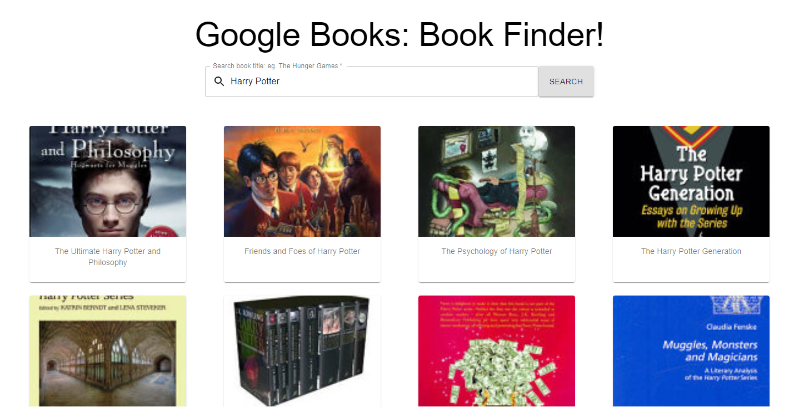
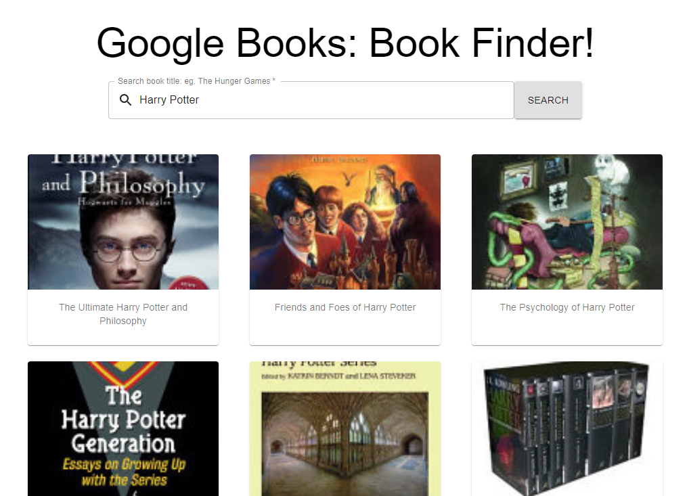
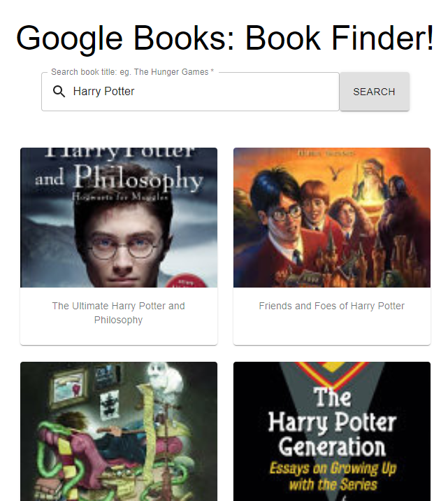
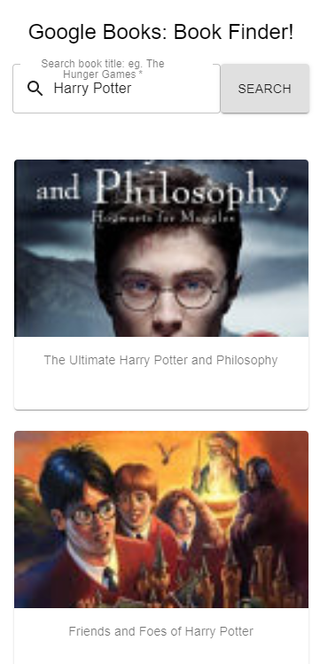
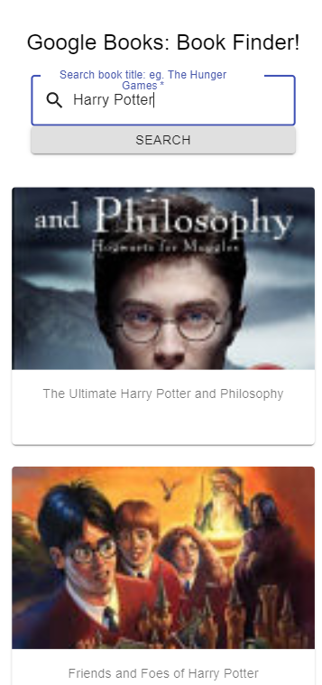
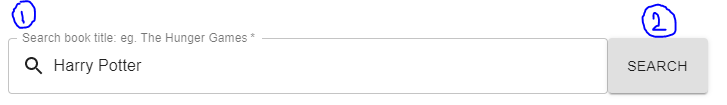
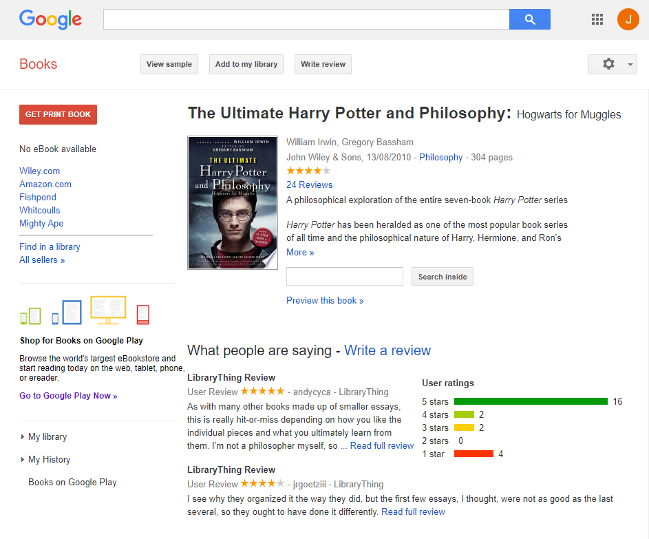

# Book Finder

[Book Finder](http://book-searcher.azurewebsites.net/) is a web based book searching tool which allows you to look for any book of your interest by inserting keywords. Book Finder keeps the result as simple as possible. It provides book titles, thumbnails, and redirections to correspondiong Google Books page. 

This project is written for 2020 [Microsoft Student Accelerator] Phase 1 Front End project.

Book Finder URL: http://book-searcher.azurewebsites.net/

# Azure Pipeline
Azure Pipeline provides automated build and test for this web-app and simplifies the deloyment process.

## Build Pipeline
This web-app is deployed using Azure Build Pipeline. 
The build pipeline enables continuous deployement by publishing new version of the web-app whenever there is a new commit detected on master or develop branch.

## Release Pipeline
The relase pipeline enables contoinuous deployement by releasing the web-app that is published by the build pipeline. THe release pipeline only releases the new version to the master branch.

## This project is written using
- [React.js]
- [Typescript]
- [Material-Ui]
- [Google Books APIs]

## Screenshots
The website is fully responsive for devices such as laptop (large, small), tablets, and mobile (large, small)

### Laptop - Large (1440px)

### Laptop - Small (1024px)

### Tablet (650px)

### Mobile - Large (375px)

### Mobile - Small (360px)

## Usage
Book Finder is very simple to use. Just like you search on Google, type any keyword in the search bar then click 'Search' button or press Enter key.

Clicking on any search result will redirect you to corresponding Google Books web page. There you can see more detailed information about the book you have selected.

[Microsoft Student Accelerator]: https://nzmsa.netlify.app/MSAProgramme
[Typescript]: https://www.typescriptlang.org/
[React.js]: https://reactjs.org/
[Material-Ui]: https://material-ui.com/
[Google Books APIs]: https://developers.google.com/books
